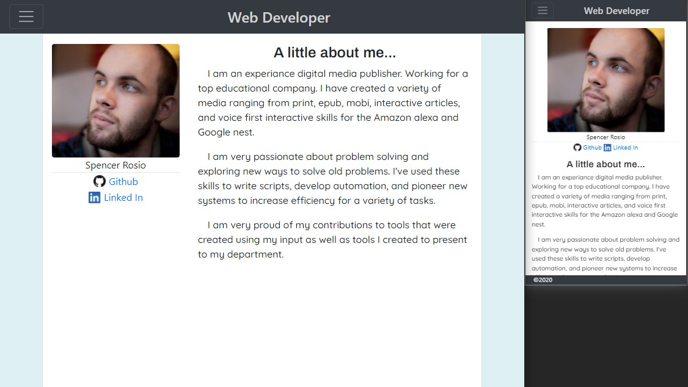
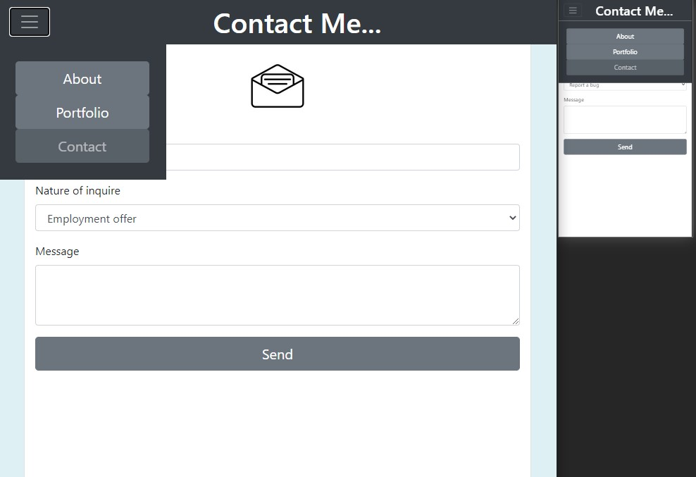
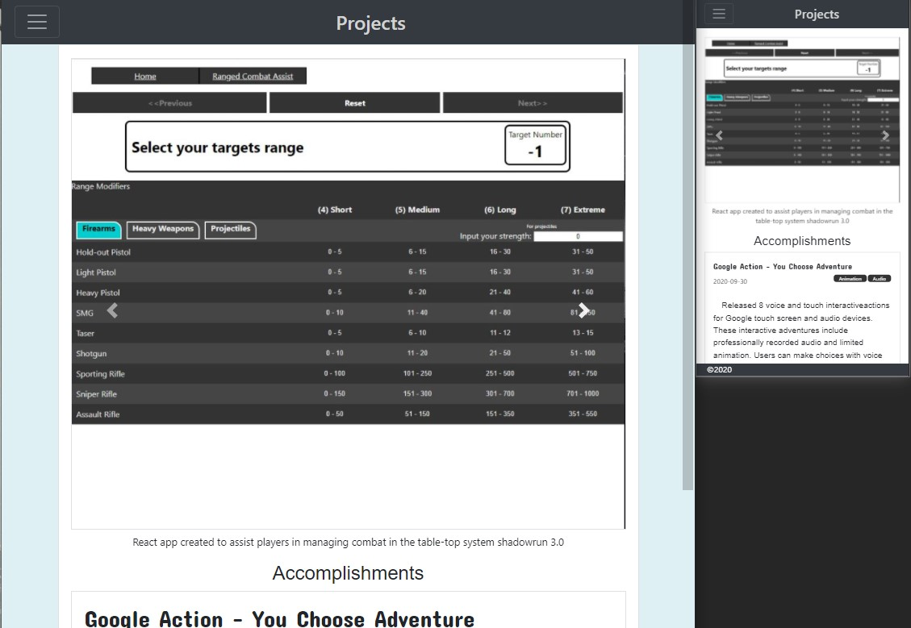

# Responsive Portfolio
* * *
## Installation
In your terminal enter:
git clone https://github.com/detanracnier/BC_10-10_Responsive_Portfolio.git
or if you have set up ssh:
git clone git@github.com:detanracnier/BC_10-10_Responsive_Portfolio.git

## Description
Use bootstrap to create a responsive portfolio site

## Deployed sight
[here](https://detanracnier.github.io/BC_10-10_Responsive_Portfolio/index.html)

Design reflows for mobile to create a better user experiance

